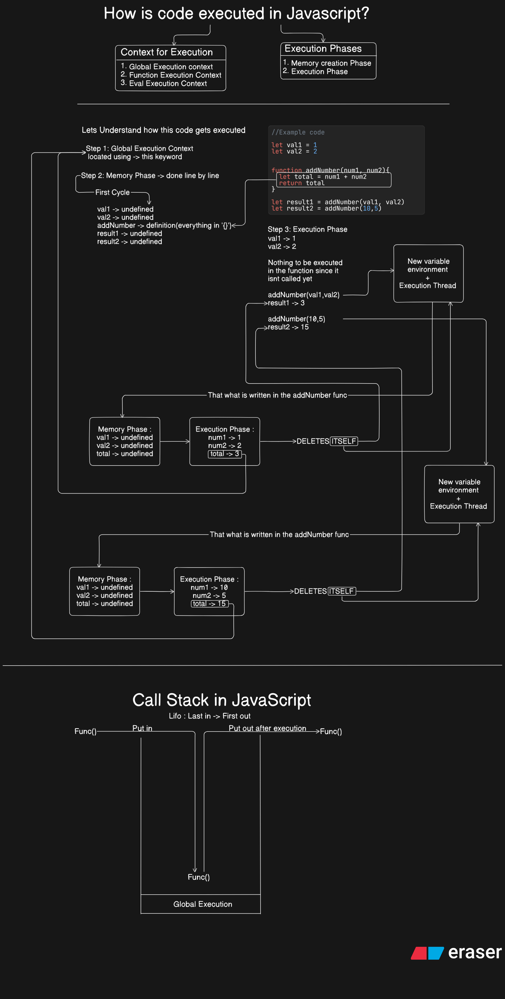

# Javascript Execution Context and Call Stack 
### Important Links
1. [Reference Docs](https://developer.mozilla.org/en-US/docs/Web/JavaScript/EventLoop)
2. [Javascript file](javascript-files/call-stack.js)

 ## Types of Execution Contexts
- **Global Execution Context**: The default context where all JavaScript code runs initially.
- **Function Execution Context**: Created whenever a function is invoked. Each function call creates a new execution context.
- **Eval Execution Context**: Created when code is executed inside an `eval()` function.

## Types of Execution Phases
- **Memory `Creation Phase`**: Variables and functions are hoisted, meaning they are stored in memory before code execution.
- **Code `Execution Phase`**: The actual code is executed line by line.

## Diagrammatic View
