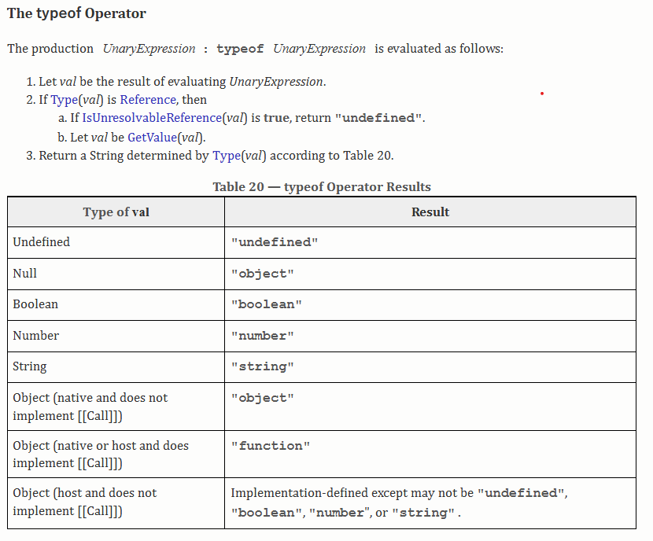

# Documentating my Learning Journey

## Variable Declaration [Reference](javascript-files/variables.js)
- 4 ways of declaring a variable : const, let, var and just **variable name**.
- **const**: used for variables that will not change.
- **let**: used for variables that can change. (Prefered over var)
- **var**: used for variables that can change, but has a function scope. 
- **variable name**: Not recommended.


## Data Types [Reference](javascript-files/datatypes.js)
- 2 main types of data types: Primitive and Reference.

<details>
<summary>Call by Value vs Call by Reference</summary>

> In call by value, when you pass a primitive type (like number, string, boolean) to a function, a copy of the value is passed, so changes inside the function do not affect the original value.

```javascript
function modifyValue(x) {
  x = x + 10;
  console.log("Inside function:", x); // 20
}

let num = 10;
modifyValue(num);
console.log("Outside function:", num); // 10 (unchanged)
```
:brain: Explanation:
- num is a primitive (number).
- A copy of num is passed to modifyValue.
- Changing x inside the function does not affect num outside.

> In call by reference, when you pass a non-primitive type (like object or array), the reference (memory address) is passed. So changes inside the function do affect the original object/array.

```javascript
function modifyObject(obj) {
  obj.name = "New Name";
}

let person = { name: "Original Name" };
modifyObject(person);
console.log(person.name); // "New Name" (changed)
```
:brain: Explanation:
- person is an object (non-primitive).
- A reference to the person object is passed.
- Modifying obj.name inside the function changes the actual object.
</details>

### typeOf Operator


### Important Note
- Primitive data types are stored in stack memory, while reference data types are stored in heap memory.
- Whenever a reference data type is created, a pointer to the memory location in the heap is stored in the stack. 
- When you assign a reference data type to another variable, both variables point to the same memory location in the heap.
- If you modify the object through one variable, the change will be reflected in the other variable as well.
- When a primitive data is assigned to another variable, a copy of the value is created, and changes to one variable do not affect the other.

### [Shalow copy v/s Deep copy](personal-learnings/shalow-copy-vs-deep-copy.md)

> We can use new keyword to create a new object, but it will not create a deep copy. It will still point to the same memory location in the heap. Objects here refer to reference types like objects, arrays, etc.


