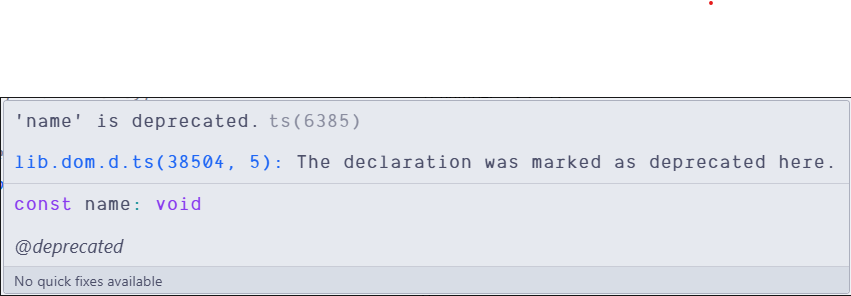
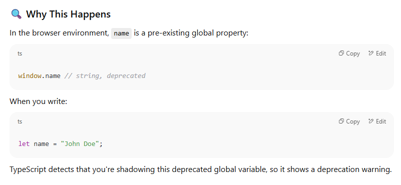

# Global Property in JavaScript

While doing the [datatypes](../javascript-files/datatypes.js) exercise, the **name** variable gave this  while running the code:

```javascript
// !Primitive Data Types in JavaScript
let name = "John Doe" // string datatype
let age = 30 // number datatype
let isEmployed = true // boolean datatype

console.log(typeof name); 
```

So, as usual, i chat-gpt the thing and turns out that **name** is a global property in JavaScript, which is used to get the name of the current script.

Chat Gpt said :
```
The warning you're seeing: is due to a conflict between your variable name (name) and the global window.name property in the DOM, which is marked as deprecated in the TypeScript DOM library.
```

ChatGPT chat screenshot :



**💡 Tip**

To avoid similar issues in the future:

- Avoid using common global names like name, location, event, etc.

- Use more descriptive variable names, especially in global scope.


## Some more details

Here’s a list of **important global names in JavaScript (especially in the browser)** that you should **avoid using as variable/function names** to prevent unexpected behavior, deprecation warnings, or conflicts:

---

### 💻 **Global Objects**

These are available globally and often used by the browser or Node.js:

| Name        | Description                      |
| ----------- | -------------------------------- |
| `window`    | The global object in browsers    |
| `document`  | Represents the DOM               |
| `console`   | For logging and debugging        |
| `navigator` | Info about browser/user agent    |
| `location`  | Current URL info                 |
| `history`   | Browser navigation history       |
| `screen`    | Info about screen display        |
| `frames`    | Refers to window frames          |
| `parent`    | The parent of a window/frame     |
| `self`      | Refers to the window itself      |
| `top`       | Top-most window in the hierarchy |

---

### 🧠 **Common Deprecated / Legacy Globals**

Avoid using these names:

| Name            | Why avoid?                                   |
| --------------- | -------------------------------------------- |
| `name`          | `window.name` is deprecated                  |
| `event`         | Used implicitly in old event handlers        |
| `status`        | Old browser status bar                       |
| `defaultStatus` | Same as above                                |
| `length`        | Global object properties may use it          |
| `closed`        | Indicates if a window is closed              |
| `opener`        | Reference to the window that opened this one |

---

### 🧪 **Built-in Constructors & Objects**

Avoid shadowing these with variables:

```js
Array, Object, String, Number, Boolean, Function, Symbol, BigInt,
Date, Math, JSON, RegExp, Error, Map, Set, WeakMap, WeakSet,
Promise, Reflect, Proxy, Intl
```

---

### 🌐 **Web APIs and Browser Functions**

These may break expected browser behavior if overwritten:

```js
setTimeout, clearTimeout,
setInterval, clearInterval,
alert, prompt, confirm,
fetch, XMLHttpRequest,
requestAnimationFrame, cancelAnimationFrame,
addEventListener, removeEventListener,
btoa, atob,
encodeURIComponent, decodeURIComponent,
encodeURI, decodeURI
```

---

### 📦 Node.js Specific (avoid in Node too)

If you’re in a Node environment, also avoid:

```js
require, module, exports, __dirname, __filename, Buffer, process, global
```

---

### ✅ How to Stay Safe

* Prefer **descriptive names**: e.g., use `userName` instead of `name`, `userAge` instead of `age`, etc.
* Use **linting tools** like ESLint with `no-shadow` and `no-restricted-globals` rules.
* TypeScript helps you catch many of these issues automatically!

Let me know if you want a **JSON, markdown, or code snippet version** of this list for your notes or Obsidian!

